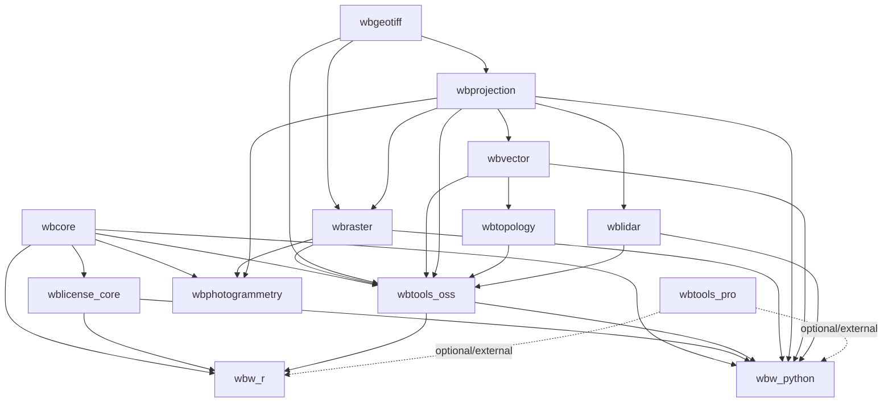

# whitebox_next_gen

Rust workspace for Whitebox next-generation backend libraries and tool crates.

## The Whitebox Project

[Whitebox](https://www.whiteboxgeo.com) is a suite of open-source geospatial data analysis software with roots at the [University of Guelph](https://geg.uoguelph.ca), Canada, where [Dr. John Lindsay](https://jblindsay.github.io/ghrg/index.html) began the project in 2009. Over more than fifteen years it has grown into a widely used platform for geomorphometry, spatial hydrology, LiDAR processing, and remote sensing research. In 2021 Dr. Lindsay and Anthony Francioni founded [Whitebox Geospatial Inc.](https://www.whiteboxgeo.com) to ensure the project's long-term, sustainable development. **Whitebox Next Gen** is the current major iteration of that work, and this repository is its home.

Whitebox Next Gen is a ground-up redesign that improves on its predecessor in nearly every dimension:

- **CRS & reprojection** — Full read/write of coordinate reference system metadata across raster, vector, and LiDAR data, with multiple resampling methods for raster reprojection.
- **Raster I/O** — More robust GeoTIFF handling (including Cloud-Optimized GeoTIFFs), plus newly supported formats such as GeoPackage Raster and JPEG2000.
- **Vector I/O** — Expanded from Esri Shapefile-only to 11 formats, including GeoPackage, FlatGeobuf, GeoParquet, and other modern interchange formats.
- **Vector topology** — A new, dedicated topology engine (`wbtopology`) enabling robust overlay, buffering, and related operations.
- **LiDAR I/O** — Full support for LAS 1.0–1.5, LAZ, COPC, E57, and PLY via `wblidar`, a high-performance, modern LiDAR I/O engine.
- **Frontends** — Whitebox Workflows for Python (WbW-Python), Whitebox Workflows for R (WbW-R), and a QGIS 4-compliant plugin are in active development.

## Design Goals

Whitebox development is guided by a small set of core priorities that, taken together, make it meaningfully different from most other geospatial software packages.

### Broad geospatial functionality with deep specialization

Whitebox aims to be a comprehensive general-purpose GIS and remote sensing toolset — covering raster analysis, vector processing, coordinate reference systems, and LiDAR — while maintaining particular depth in geomorphometry, spatial hydrology, and point-cloud processing. Breadth and depth are both first-class goals.

### Full-stack architecture

Most geospatial software packages — open-source and commercial alike — are built on a common foundation of external C/C++ libraries such as GDAL, PROJ, and GEOS for low-level I/O, projection, and geometry. Whitebox deliberately does not follow that model.

Whitebox is **full-stack**: all foundational plumbing — GeoTIFF I/O, map projections, raster abstraction, vector I/O, LiDAR parsing, and topology — is implemented in this codebase rather than delegated to external libraries. This choice has several important consequences:

- **Performance** — Every interface between a library boundary introduces overhead and reduces the ability to optimize holistically. Owning the full stack means Whitebox can tune performance end-to-end without friction at foreign-function interfaces.
- **Development velocity** — There is no dependency on upstream library release cycles, no forced adaptation to breaking changes in third-party APIs, and no need to wait for upstream maintainers to prioritize features or fixes that Whitebox needs.
- **Flexibility** — Owning the stack allows Whitebox to make design decisions — data representations, memory layouts, codec choices — that would be impossible or impractical when adapting a general-purpose external library to a specialized use case.

### Pure Rust, minimal dependencies

The full-stack architecture and the choice of pure Rust are deeply linked. Rust provides the performance headroom that makes it practical to implement things like LiDAR codecs, map projection engines, and raster I/O entirely from scratch without sacrificing speed. It also brings memory safety without a garbage collector, and excellent cross-platform compilation with no native toolchain requirements at build time.

External crates are used where they provide clear, well-contained value (compression codecs, serialization formats, etc.), but Whitebox avoids dependencies that would pull in C/C++ linkage or impose significant API coupling.

### Innovation in spatial analysis

Whitebox is a research vehicle as much as a production tool. New spatial analysis algorithms — particularly in geomorphometry and spatial hydrology — are developed, tested, and published through Whitebox first, then made available to the wider community.

### Human–AI collaborative development

Whitebox Next Gen embraces human–AI collaboration as a first-class part of the development process, using it to accelerate implementation, improve documentation, and explore algorithm design. This is reflected in development pace and project scope.

---

## Project Model

Whitebox Next Gen follows an open-core model:

- All backend engine crates in this workspace are open source.
- The majority of the 500+ tools are open source in `crates/wbtools_oss`.
- A proprietary paid extension product exists outside this OSS workspace for additional commercial capabilities.

This structure is intentional. Revenue from the paid extension helps fund ongoing OSS development, maintenance, support, and long-term sustainability of the open project.

## Workspace Crates

- crates/wbgeotiff
- crates/wbprojection
- crates/wbraster
- crates/wbvector
- crates/wblidar
- crates/wbtopology
- crates/wbcore
- crates/wblicense_core
- crates/wbtools_oss
- crates/wbw_python
- crates/wbw_r

## Publication Status

At initial public launch, the following six backend crates are intended to be published on crates.io:

- `wbgeotiff`
- `wbprojection`
- `wbraster`
- `wbvector`
- `wbtopology`
- `wblidar`

Other workspace crates are open-source and developed in this monorepo, but are not yet targeted for initial crates.io publication:

- `wbcore`
- `wblicense_core`
- `wbtools_oss`
- `wbw_python`
- `wbw_r`
- `wbphotogrammetry`

This staged publishing model keeps the foundational backend stack available first while higher-level crates continue to stabilize.

## Crate Relationship Diagram



Legend:

- `A --> B` means crate `B` depends on crate `A`.
- `wbtools_pro` is optional and outside this workspace.

## Monorepo Publishing Model

This repository is a Cargo workspace (monorepo). Each crate is developed in-place
under `crates/`, but published independently on crates.io.

- Crates remain individually discoverable on crates.io by package name.
- Local development uses `path` dependencies.
- Published packages use `version` dependencies automatically when uploaded.

In this model, all crates share one repository URL in Cargo metadata, while each
crate source lives at its own subdirectory URL:

- `https://github.com/jblindsay/whitebox_next_gen/tree/main/crates/wbgeotiff`
- `https://github.com/jblindsay/whitebox_next_gen/tree/main/crates/wbprojection`
- `https://github.com/jblindsay/whitebox_next_gen/tree/main/crates/wbraster`
- `https://github.com/jblindsay/whitebox_next_gen/tree/main/crates/wbvector`
- `https://github.com/jblindsay/whitebox_next_gen/tree/main/crates/wbtopology`
- `https://github.com/jblindsay/whitebox_next_gen/tree/main/crates/wblidar`

Current backend publish order:

1. wbgeotiff
2. wbprojection
3. wbraster
4. wbvector
5. wbtopology
6. wblidar

Run backend readiness checks from repo root:

```bash
bash scripts/check_backend_publish_readiness.sh
```

The readiness check validates package metadata and runs `cargo package --allow-dirty --no-verify`
for each backend crate so dependency-order blockers are visible before publish.

Run publish-order dry-run checks (stop at first blocked crate):

```bash
bash scripts/publish_backend_dry_run.sh
```

Run maintainer-only internal workflows:

```bash
bash scripts/run_maintainer_workflows.sh list
```

## Licensing in OSS

This repository includes `crates/wblicense_core` for open, auditable license entitlement verification and capability evaluation.

This does not make the project non-OSS. The crate contains public trust logic (verification and policy checks), not private commercial issuance logic.

See `crates/wblicense_core/README.md` for details on scope and architecture boundaries.

Binding-specific runtime licensing behavior (tier fallback, provider bootstrap,
and policy controls) is documented in:

- `crates/wbw_python/README.md` ("Licensing and startup behavior")
- `crates/wbw_r/README.md` ("Licensing and startup behavior")

Note on floating licenses: lease lifecycle support is present, and automatic
"floating license ID only" exchange on a brand-new machine is available when
provider bootstrap is configured (`WBW_LICENSE_PROVIDER_URL` +
`WBW_FLOATING_LICENSE_ID`) and the provider exposes the v2 floating activation
endpoint. See the runbook sections in the Python/R READMEs.

## SIMD Guardrail Check

Run the lightweight SIMD regression guardrail locally:

```bash
bash scripts/check_simd_guardrails.sh
```

What it checks:

- wbprojection SIMD example runs and reports speedup above threshold
- wbprojection kernel and geocentric batch correctness markers remain true
- wbraster SIMD statistics example runs and reports speedups above threshold
- wbraster full-raster and band scalar/SIMD match markers remain true

Optional threshold overrides:

```bash
WBPROJ_SPEEDUP_MIN=1.10 WBRASTER_SPEEDUP_MIN=1.10 bash scripts/check_simd_guardrails.sh
```

Default thresholds are conservative and intended as a lightweight early warning, not a strict performance certification.
