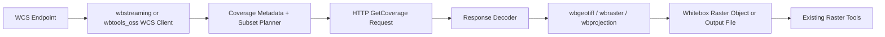

# WCS Remote Coverage Support: Architecture Sketch

**Date:** May 25, 2026
**Status:** Concept sketch
**Scope:** Whitebox Next Gen backend architecture

## 1. Decision Summary

Whitebox can reasonably support OGC Web Coverage Service (WCS) as a remote data-access capability, but it should be treated as a network-facing source layer rather than a geoprocessing tool.

The most important design decision is placement:

- **Not `wbw_r`**: that crate is the R API surface, so it is the wrong architectural home for a standards client.
- **Best fit for a minimal first pass**: `wbtools_oss`, if the implementation is limited to common raster coverage retrieval and direct handoff to existing raster tooling.
- **Best fit for a broader service layer**: a dedicated `wbstreaming` crate, if Whitebox wants to support multiple remote streaming/data-service protocols over time, not just WCS.

Recommended direction:

1. Treat WCS as a remote coverage client.
2. Keep the protocol logic above the low-level format crates.
3. Prefer a dedicated `wbstreaming` crate if the project expects additional service protocols later.

## 2. Why WCS Is Feasible

WCS is a practical fit for Whitebox because it delivers coverages over HTTP, and Whitebox already has strong raster handling once data is local.

The OGC WCS standard is mainly about:

- discovering available coverages
- describing coverage metadata and dimensions
- requesting a subset of a coverage over HTTP
- choosing a response encoding

That means the hard parts are mostly outside the existing raster algorithms:

- HTTP request/response handling
- XML/JSON capability parsing
- coverage subset parameter construction
- response decoding and local raster materialization

Whitebox already has the downstream pieces needed after retrieval:

- raster read/write support
- GeoTIFF support
- projection handling
- vector/raster interoperability patterns

So the main question is not “can Whitebox use WCS?” but “where should the network client and coverage adapter live?”

## 3. Suggested Scope for v1

The first version should be intentionally narrow.

### 3.1 In Scope

- WCS service discovery.
- Coverage listing and metadata inspection.
- Retrieval of raster coverages via `GetCoverage`.
- Bounding-box subset requests.
- CRS selection where the service supports it.
- Optional time/elevation subset support if the service advertises those dimensions.
- Response handling for common raster encodings, especially GeoTIFF and Cloud Optimized GeoTIFF where available.
- Local staging of the retrieved coverage into a Whitebox raster object or output file.

### 3.2 Out of Scope for v1

- Full standards completeness for every WCS extension.
- Complex mesh and point-cloud coverage encodings.
- Subsetting logic for every dimension type and vendor extension.
- Server-side caching or tiling proxies.
- Authentication workflows beyond basic token/header support.
- GUI-first implementation details before the backend contract is stable.

## 4. Recommended Layering

The cleanest architecture is a split between protocol, decode, and raster use.

### 4.1 If Implemented in `wbtools_oss`

This makes sense if the feature is only “fetch remote raster coverages and feed them into OSS tools.”

Pros:

- fewer crates
- quicker to prototype
- easy access to existing tool registry patterns

Cons:

- the crate can become a catch-all for unrelated network sources
- harder to grow into a generic streaming/service abstraction later

### 4.2 If Implemented in `wbstreaming`

This is the cleaner long-term option if Whitebox wants support for multiple remote data services.

Possible future protocols:

- WCS
- WMS GetMap-style raster retrieval, if useful as a source layer
- tile services or coverage tiles
- STAC-backed asset resolution
- cloud/object-storage coverage fetchers
- other stream-oriented geodata sources that feed Whitebox tools

Pros:

- separates service clients from tool execution crates
- keeps protocol-specific parsing in one place
- gives Whitebox a reusable abstraction for remote data sources

Cons:

- adds a new crate and a little architectural overhead
- requires careful definition of the shared source API

## 5. What the Backend Would Need

### 5.1 HTTP and Content Negotiation

The backend would need an HTTP client with support for:

- GET and query-parameter construction
- optional headers and bearer tokens
- content-type inspection
- redirects and timeouts
- streaming or buffered downloads depending on payload size

Rust options are straightforward here. Whitebox already uses HTTP in some areas, so this is not a new class of dependency.

### 5.2 Capabilities and Coverage Metadata

WCS support starts with schema-aware discovery.

The client would need to parse:

- service capabilities
- coverage identifiers
- supported formats
- supported CRS values
- axis labels and dimension metadata
- default ranges and optional subset rules

This metadata is what lets Whitebox turn a user request into a valid `GetCoverage` query.

### 5.3 Subset Planner

Whitebox should not assume users will know WCS parameter syntax.

Instead, the backend should map higher-level inputs to WCS query parameters:

- bounding box
- output CRS
- width/height or resolution target
- time or elevation subsets when available
- format preference

This planner is where a future frontend can stay simple.

### 5.4 Response Decoding

The response path depends on the encoding.

Practical first targets:

- GeoTIFF
- Cloud Optimized GeoTIFF

Possible later targets:

- NetCDF / CF-style coverages
- XML/GML encodings where needed
- vendor-specific encodings with adapters

The more the service can return GeoTIFF, the simpler the integration becomes.

### 5.5 Raster Materialization

Once a coverage is downloaded, the backend should convert it into a form Whitebox can use immediately:

- write to a temporary local raster
- or materialize into an in-memory raster object if the size and API make that reasonable

After that, the existing raster stack can take over.

## 6. Integration Points

### 6.1 `wbgeotiff`

Useful when the service returns GeoTIFF or COG.

### 6.2 `wbraster`

Useful for in-memory coverage representation, pixel access, resampling, and passing the result into existing tools.

### 6.3 `wbprojection`

Useful for CRS parsing, CRS comparison, and any reprojection step after download.

### 6.4 `wbvector`

Useful if Whitebox later adds WCS-related footprint queries, coverage extents, or bounding geometry helpers.

### 6.5 `wblidar`

Probably not needed for a first WCS raster client, but the same service abstraction could later support elevation products or point-cloud-adjacent services.

### 6.6 `wbtopology`

Probably not needed directly, though higher-level coverage clipping or extent logic might eventually use it.

## 7. API Shape Suggestion

If a dedicated crate is created, a simple source-oriented API would be easier to grow than a tool-specific one.

Possible concepts:

- `WcsClient`
- `CoverageService`
- `CoverageDescriptor`
- `CoverageSubsetRequest`
- `CoverageResponse`
- `RemoteRasterSource`

The ideal pattern is:

1. discover service
2. choose coverage
3. describe coverage
4. build subset request
5. fetch response
6. decode response
7. hand off to raster pipeline

## 8. Frontend Implications

The backend should stay first.

Frontend layers can later provide convenience wrappers:

- QGIS dialog for service URL and coverage selection
- Python convenience function for loading a coverage into a raster workflow
- R wrapper for scripted retrieval

But these should be thin clients over the same backend source API.

That keeps behavior consistent and avoids three separate protocol implementations.

## 9. Risks and Constraints

### 9.1 Standards Complexity

WCS is not just “download a raster.” The standard includes core requirements and extensions, so a standards-complete implementation can grow quickly.

### 9.2 Encoding Diversity

Different servers expose different formats and dimension conventions. The backend needs to be defensive and explicit about what is supported.

### 9.3 Large Payloads

Coverage responses can be large. The implementation should prefer streaming downloads or temporary-file staging rather than assuming small in-memory responses.

### 9.4 CRS and Grid Alignment

Subset parameters, source CRS, and target grid resolution all need careful handling so Whitebox does not introduce silent misalignment.

### 9.5 Error Reporting

The client should return service-level errors clearly:

- invalid coverage identifier
- unsupported format
- unsupported CRS
- subset outside coverage extent
- timeout or download failure
- schema parse failure

## 10. Recommended Phasing

### Phase 1: Source Client Prototype

- Implement a minimal WCS client.
- Support capabilities parsing and one GeoTIFF/COG retrieval path.
- Land it in `wbstreaming` if the crate is created, or in `wbtools_oss` if the project wants a smaller change.

### Phase 2: Raster Integration

- Convert downloaded coverage into a Whitebox raster object.
- Add basic reprojection and resampling compatibility.
- Ensure existing raster tools can consume the result.

### Phase 3: Frontend Convenience

- Add Python/R/QGIS helpers.
- Keep them thin and declarative.

### Phase 4: Additional Streaming Services

- Generalize the crate if more remote sources become useful.
- Add STAC, tiles, or other coverage-like sources behind the same abstraction.

## 11. Bottom-Line Recommendation

If the goal is only WCS for raster ingestion, the feature is very feasible and could live in `wbtools_oss`.

If the goal is a broader, reusable remote-data layer for Whitebox, a dedicated `wbstreaming` crate is the better long-term home.

Either way, the implementation should sit above the format crates and below the frontend wrappers.
